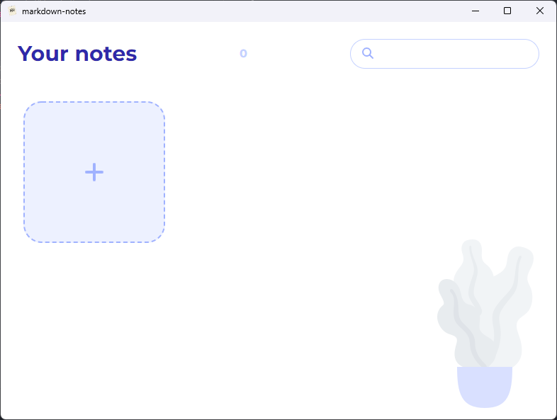

<div align="center">
  
  <h1>Markdown Notes</h1>
  <strong>Приложение для введения заметок в формате markdown</strong>
</div>

[](https://github.com/EremenkoVO/Markdown-Notes/actions/workflows/main.yml)



Приложение находится в статусе `beta`

# Сборка

```
yarn install
yarn electron:win или yarn electron:linux
```
